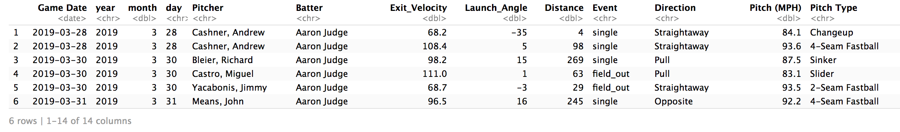
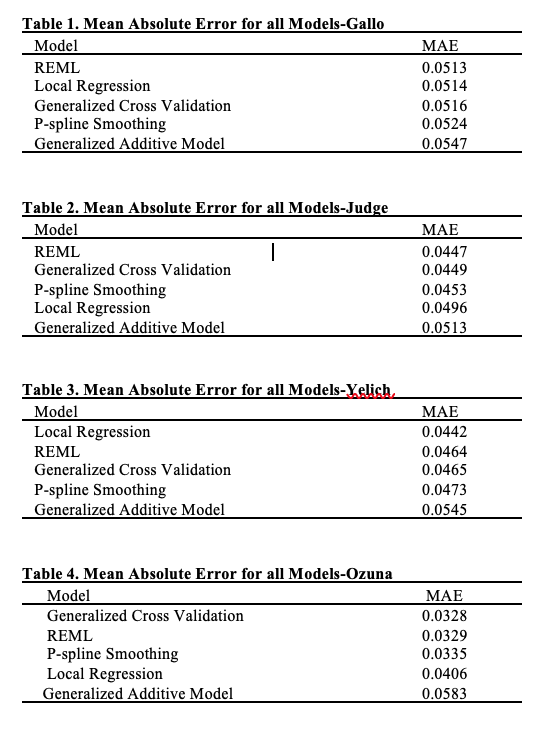
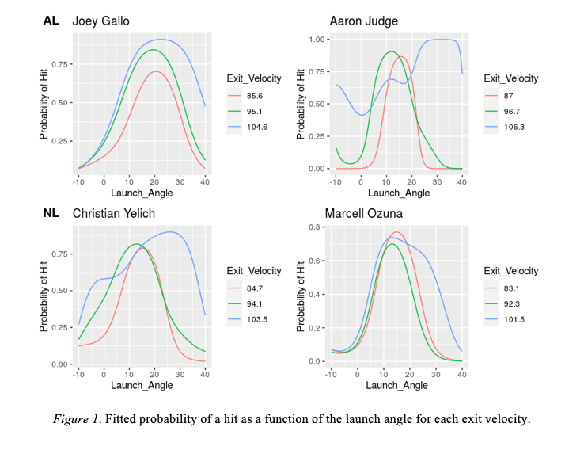

# PREDICTING BATTER PERFORMANCE USING STATCAST DATA IN MAJOR LEAGUE BASEBALL
SIGNIFICANT PREDICTORS OF MLB BATTER PERFORMANCE USING STATCAST METRICS

## 1. Introduction

In ways like never before, Major League Baseball (MLB) teams are embracing analytical tools to further enhance team performance and decision making to maximize odds of winning. Analytics in baseball can be grouped into three different time periods: The Traditional Stats Era (up unto the 2000’s), Moneyball/Sabermetrics Era (2000’s – 2014), and now the emergence of the Statcast Era [11]. Major League Baseball defines Statcast as a, “state-of-the-art tracking system that uses high-resolution cameras and radar equipment to measure the precise location and movement of baseballs and baseball players” [10]. The tracking system allows front offices, broadcasters, and fans to quantify raw skills of players that weren’t available previously. This revolution has provided new outlooks for hitters attempting to gain advantages over their opponents. Hitters have focused specifically on the launch angle of the ball off the bat and the exit velocity of the ball after initial contact [9]. The number one issue is what combination of launch angle and exit velocity should hitters aim for? 

### First Objective
The first objective of this paper is the comparison of five predictive models in relation to which is the most accurate representation of a hitter’s performance based upon his exit velocity and launch angle. With the data collected from the 2019 season our model estimates the probability (0 to 1) of hitting a hit for our respective players using the constants and model coefficients and forecasts expected hit percentage that a hitter will achieve based on their statistics over the course of the season. The result shows the intersection of the best launch angle and exit velocity that produces the highest perceived hit probability for our individual hitter will be helpful in further enhancing hit probability and improving poorer hit probability areas. The best fitting model has a mean absolute error of 5.13 percentage points from a hitter’s actual hit outcome.

### Second Objective
The second objective of this paper is to examine significant factors in a batter’s exit velocity (BEV). This regression was able to sift out the statistically significant factors for each of our four hitters exit velocity at the 95% confidence level. 

## Data Description

The data we utilized included full season 2019 MLB Statcast Game Logs for four players: Aaron Judge, Joey Gallo, Marcell Ozuna, and Christian Yelich. The datasets for our each of our respective players was obtained from baseball Savant https://baseballsavant.mlb.com/statcast_leaderboard
They were then scraped into individual datasets for each player. We intently focused on obtaining an accurate depiction of exit velocity and it's potential predictors by including one right handed hitter from the American League, one right handed hitter from the National League, one left handed hitter from the American League, and one left handed hitter from the National League. This was done to ensure an accurate representation of exit velocity league wide while taking into account batter handedness.

### Data Sample

## More Info

Listed above in the repository are several different items: 

* The variable_defintions include all of the variables defined by Major League Baseball
* The r.package.versions include all of the r packages that were used and their versions at the time of use
* The edited final paper includes my paper that I wrote that details the analysis from start to finish
* The data folder includes a description of the data, data sample head, and each csv dataset for each of the four players
* The R_code folder includes an in depth summary of the analysis and each code file for each player

# Fitted Probability of a Hit

Five varieties of models are evaluated using the dependent variable outcome (0 to 1) to estimate the fit and probability of a hit : generalized additive models (GAM), p-spline smoothing, restricted maximum likelihood (REML), local regression (loess), and generalized cross validation (GCV). 

The models performance was graded based upon the mean absolute error and compared across all players:

Three different lines are graphed on each plot that highlight three different exit velocity values. The green line represents the mean exit velocity for our hitter over the course of the 2019 season. While the red line represents an exit velocity 10% below the mean and the blue line signifies 10% above the mean. 

# Predictors of a Hitter's Exit Velocity

Gallo’s significant predictors are as such: Month [-1.57, 0.013], Launch_Angle [0.05, 0.33], Distance [0.01, 0.07], DirectionPull [6.44, 19.48], DirectionStraightaway [2.98, 17.29], Event_Field_Out [-15.23, -0.28], Event_Force_Out [-53.2, -2.26]. 

Judge’s significant predictors are Month [-1.82, 0.025], Distance [0.025. 0.07], Event_Field_Out [-14.56, -1.66], DirectionPull [2.15, 11.78], DirectionStraightaway [1.59, 10.13], PitchTypeChangeup [-14.45, -1.21]. 

Yelich’s significant predictors are Distance [-0.021, 0.04], DirectionPull [4.63, 12.81], DirectionStraightaway [1.70, 9.34], Event_Field_Out [-15.00, -3.50], Event_Force_Out [-22.00, -2.99], Event_Grounded_Into_Dp [-24.2, -1.05], Event_Single [-13.00, -0.72]. 

Ozuna’s significant predictors are Distance [0.023, 0.05], DirectionPull [4.63, 12.12], DirectionStraightaway [-0.18, 7.46], Event_Field_Out [-11.45, -0.42], PitchType4-SeamFastball [3.09, 10.90], PitchTypeCutter [-0.01, 12.74], PitchTypeKnuckle-Curve [2.19, 22.50], PitchTypeSinker [3.12, 14.13], PitchTypeSlider [-0.74, 10.74], Pitch(MPH) [0.07, 0.95]. 

